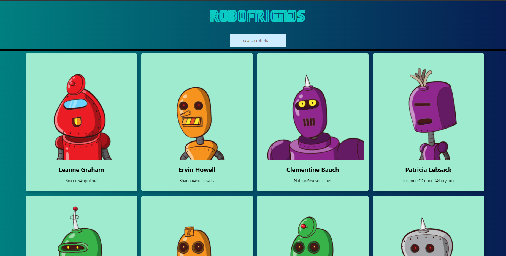
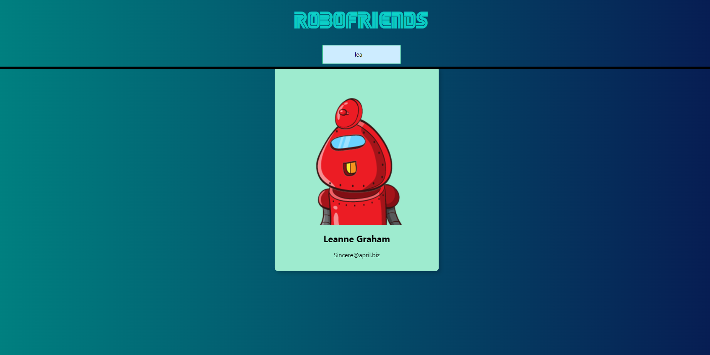
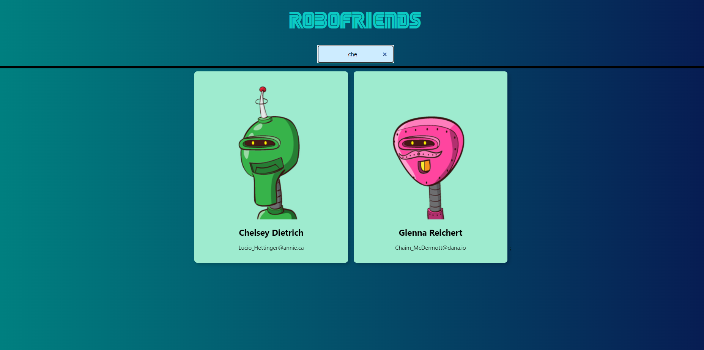

 # RoboFriends 🤖💻

RoboFriends is a sleek and user-friendly web application that allows you to find and connect with robots from all around the world! Powered by a powerful API, RoboFriends provides an exhaustive list of robots complete with their usernames and emails. What sets RoboFriends apart is its advanced filtering mechanism, enabling you to find the specific robots you are looking for in a matter of seconds.

## Features 🚀
- Comprehensive Database: Access an extensive list of robots with detailed information, including usernames and emails.
- Dynamic Filtering: Effortlessly filter robots based on your specific criteria to find the perfect match.
- User-Friendly Interface: Intuitive design and seamless user experience for quick and easy navigation.
- Real-time Data: Connects to an API to ensure you get the most up-to-date and accurate information.
- Responsive Design: RoboFriends is optimized for various devices, providing a consistent experience across desktops, tablets, and smartphones.
## How to Use 🤔
1. Visit the RoboFriends Website: Open [http://localhost:3000](http://localhost:3000) to view it in your browser.
2. Explore the Database: Browse through the extensive list of robots to see their usernames and emails.
3. Filter Your Search: Use the powerful filtering options to narrow down the results based on your preferences.
4. Connect with Robots: Once you find the robots you are interested in, click on their profiles to connect or learn more about them.

### Home page: 

## Search Box

